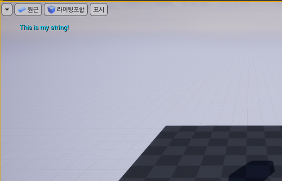

### The Level Blueprint

* 블루프린트: 시각적인 방식으로 코딩하는 것
  * 이벤트 그래프: 로직이 발생하는 곳
  * 내 블루 프린트: 변수, 함수, 매크로, 이벤트 디스패처 등 새로운 변수를 추가할 수 있다.
  * 디테일 패널: 블루프린트에 맞게 조정할 수 있는 파라미터들이 존재한다.
* 노드: C++에서 변수와 함수처럼 동작하는 각각의 오브젝트를 의미한다.
* 이벤트 그래프 창에서 우클릭 시 다양한 범주가 있는 메뉴가 뜬다.
  * F: Function
  * BeginPlay는 액터가 플레이를 시작할 때, 레벨 블루프린트에서는 기본적으로 게임이 시작될 때 호출된다.
* 노드 작동 방식
  * 노드에 달린 화살표를 눌러서 연결한다.
  * BeginPlay에 연결한 Print String function을 이용하면, 플레이 버튼을 눌렀을 때 좌측 상단에 문자열이 표시된다.
  * Print String 하단에 있는 화살표(▼)를 누르면 다양한 설정을 변경할 수 있다.

	

* 틱 노드
  * 프레임마다 호출된다.
  * 뷰 포트의 화살표를 누르고, FPS 표시를 누르면 FPS를 볼 수 있다.
  * FPS: 월드에서 발생하는 초당 프레임 수
  * ms 표시된 숫자: 프레임당 밀리 초

